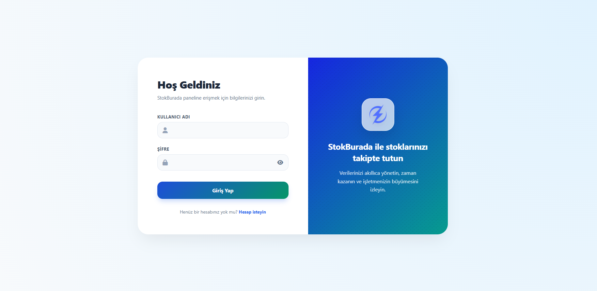
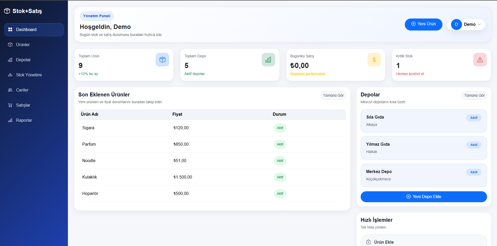
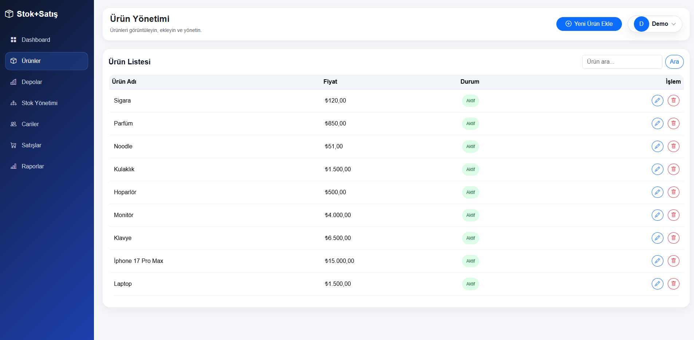
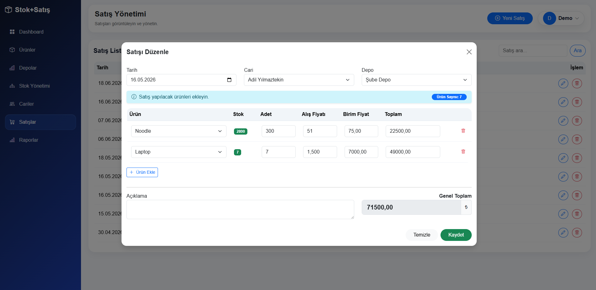
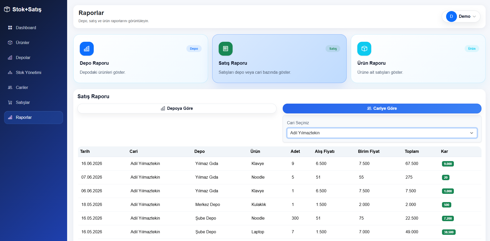

# StokBurada - Stok & Satış Yönetim Sistemi v1.0
# Stock & Sales Management System v1.0

## 🚀 Proje Özeti
StokBurada; işletmelerin ürün, stok, depo ve satış süreçlerini tek bir platform üzerinden yönetebilmesini sağlayan web tabanlı bir stok ve satış yönetim sistemi geliştirmek amacıyla hazırlanmıştır.


## Bilgilerim
Ad-Soyad: Adil Yılmaztekin
Öğrenci Numarası: 23010502032


[](https://stokburada.com.tr)
[](https://github.com/AdilYilmaztekin/stok-satis-projesi)
[](https://nodejs.org/)
[](https://expressjs.com/)
[](https://www.mysql.com/)
[](LICENSE)

Etkili ve kullanıcı dostu stok yönetimi ve satış takibi için kapsamlı web tabanlı çözüm. Node.js backend, Express API ve MySQL veritabanı ile geliştirilmiştir.

---

## 🔗 Hızlı Linkler

| 🌐 Platform | Link |
|:--:|:--|
| **📱 Web Uygulaması** | [app.stokburada.com.tr](https://app.stokburada.com.tr) |
| **🏠 Landing Page** | [stokburada.com.tr](https://stokburada.com.tr) |
| **📦 GitHub Repository** | [github.com/AdilYilmaztekin/stok-satis-projesi](https://github.com/AdilYilmaztekin/stok-satis-projesi) |

---

## ✨ Ana Özellikler

### 📊 **Stok Yönetimi**
- ✅ Gerçek zamanlı stok takibi
- ✅ Stok seviyesi uyarıları
- ✅ Otomatik envanter güncelleme
- ✅ Stok hareketleri raporu

### 🛍️ **Satış Modülü**
- ✅ Hızlı ve kolay satış kaydı
- ✅ Satış raporları ve istatistikleri
- ✅ Günlük/Aylık/Yıllık satış analizi
- ✅ Ürün bazlı satış detayları

### 🏭 **Depo Yönetimi**
- ✅ Çoklu depo desteği
- ✅ Depo bazlı stok kontrolü
- ✅ Depo transfer işlemleri
- ✅ Depo raporlaması

### 👥 **Cari/Müşteri Yönetimi**
- ✅ Müşteri veritabanı
- ✅ Müşteri bilgileri ve geçmişi
- ✅ Cari bakiyesi takibi
- ✅ Müşteri segmentasyonu

### 📈 **Raporlama & Analiz**
- ✅ Dinamik raporlar
- ✅ Grafiksel istatistikler
- ✅ PDF export seçeneği
- ✅ Verilerin CSV formatına aktarılması

### 🔐 **Güvenlik & Yönetim**
- ✅ Kullanıcı kimlik doğrulaması
- ✅ Rol tabanlı erişim kontrolü (RBAC)
- ✅ İşlem loglaması
- ✅ Veritabanı güvenliği

---


---

# 📸 Ekran Görüntüleri

## 🔐 Giriş Sayfası



---

## 📊 Dashboard



---

## 📦 Ürün Yönetimi



---

## 💰 Satış Yönetimi



---

## 📈 Raporlar



---

## 🛠️ Teknoloji Stack

### Backend
- **Runtime**: Node.js 18+
- **Framework**: Express.js 5.2
- **Package Manager**: npm
- **Development Tool**: Nodemon

### Database
- **DBMS**: MySQL 8.0
- **Driver**: mysql2
- **Connection**: Pool-based

### Frontend
- **HTML5**, **CSS3**, **JavaScript (ES6+)**
- **Responsive Design**: Mobile-friendly interface
- **CORS**: Cross-origin support

### Tools & Libraries
- **Environment**: dotenv
- **CORS**: Express CORS middleware
- **Version Control**: Git

```
Backend Stack: Node.js → Express → MySQL
Frontend: HTML5 + CSS3 + JavaScript
API: RESTful Architecture
```

---

## 📁 Proje Yapısı

```
stok-satis-projesi/
├── public/                          # Frontend dosyaları
│   ├── img/                         # Resimler ve iconlar
│   ├── js/                          # JavaScript dosyaları
│   │   ├── common.js               # Ortak fonksiyonlar
│   │   ├── index.js                # Ana sayfa scripti
│   │   ├── login.js                # Giriş scripti
│   │   ├── products.js             # Ürün yönetimi scripti
│   │   ├── stocks.js               # Stok scripti
│   │   ├── warehouses.js           # Depo scripti
│   │   ├── sales.js                # Satış scripti
│   │   ├── caris.js                # Cari scripti
│   │   └── reports.js              # Raporlar scripti
│   ├── style.css                   # Ana stil dosyası
│   ├── index.html                  # Dashboard
│   ├── login.html                  # Giriş sayfası
│   ├── products.html               # Ürün yönetimi
│   ├── stocks.html                 # Stok yönetimi
│   ├── warehouses.html             # Depo yönetimi
│   ├── sales.html                  # Satış
│   ├── caris.html                  # Müşteri/Cari
│   └── reports.html                # Raporlama
│
├── src/                             # Backend kaynağı
│   ├── app.js                      # Ana uygulama dosyası
│   ├── config/
│   │   └── db.js                   # Veritabanı konfigürasyonu
│   ├── controllers/                # İş mantığı
│   │   └── loginController.js      # Kimlik doğrulama
│   └── routes/                     # API routes
│       ├── loginRoutes.js          # Giriş API'si
│       ├── productRoutes.js        # Ürün API'si
│       ├── stockRoutes.js          # Stok API'si
│       ├── warehouseRoutes.js      # Depo API'si
│       ├── salesRoutes.js          # Satış API'si
│       └── carisRoutes.js          # Cari API'si
│
├── .env.example                    # Environment örneği
├── .gitignore                      # Git ignore kuralları
├── package.json                    # Proje bağımlılıkları
├── package-lock.json               # Bağımlılıklar lock dosyası
└── README.md                       # Bu dosya
```

---

## 🛠️ Kurulum & Yapılandırma

### Ön Koşullar

```bash
✓ Node.js 18 veya üzeri
✓ npm 9 veya üzeri
✓ MySQL 8.0
✓ Git
```

### 1️⃣ Repository'yi Klonlayın

```bash
git clone https://github.com/AdilYilmaztekin/stok-satis-projesi.git
cd stok-satis-projesi
```

### 2️⃣ Bağımlılıkları Yükleyin

```bash
npm install
```

### 3️⃣ Environment Dosyasını Ayarlayın

```bash
cp .env.example .env
```

`.env` dosyasını açıp aşağıdaki değerleri ayarlayın:

```env
# Server
PORT=3000

DB_HOST=turntable.proxy.rlwy.net
DB_PORT=23892
DB_USER=root
DB_PASSWORD=BTsHhFRZJKBFcByGsskIQKBROueaEwOt
DB_NAME=railway
```

### 4️⃣ Veritabanını Oluşturun

MySQL'de aşağıdaki komutları çalıştırın:

```sql
CREATE DATABASE stok_satis_db;
USE stok_satis_db;

-- Tablolar burada oluşturulacak
-- (Veritabanı script'i dahil edilir)
```

### 5️⃣ Sunucuyu Başlatın

**Development Mode (Nodemon ile otomatik restart):**
```bash
npm run dev
```

**Production Mode:**
```bash
npm start
```

Sunucu başarıyla çalıştığında göreceksiniz:
```
✓ Server http://localhost:3000 adresinde çalışıyor
✓ Veritabanı bağlantısı başarılı
```

---

## 📖 Kullanım

### Giriş

Tarayıcınızı açıp aşağıdaki adrese gidin:
```
http://localhost:3000
```

### Demo Hesapları

| Kullanıcı | Şifre | Rol |
|:--:|:--:|:--:|
| **demo** | demo | Demo Kullanıcı |
| **adil** | adil | Admin |

> ⚠️ **Güvenlik Notu**: Demo hesaplarını production ortamında kullanmayın!

### API Endpoints

#### 🔐 Kimlik Doğrulama
```http
POST /api/login               # Giriş yap
```

#### 📦 Ürünler
```http
GET    /api/products          # Tüm ürünleri listele
POST   /api/products          # Yeni ürün ekle
PUT    /api/products/:id      # Ürünü güncelle
DELETE /api/products/:id      # Ürünü sil
```

#### 📊 Stoklar
```http
GET    /api/stocks            # Tüm stokları listele
POST   /api/stocks            # Yeni stok ekle
PUT    /api/stocks/:id        # Stok güncelle
DELETE /api/stocks/:id        # Stok sil
```

#### 🏭 Depolar
```http
GET    /api/warehouses        # Depolar listesi
POST   /api/warehouses        # Yeni depo ekle
PUT    /api/warehouses/:id    # Depo güncelle
DELETE /api/warehouses/:id    # Depo sil
```

#### 🛍️ Satışlar
```http
GET    /api/sales             # Satışları listele
POST   /api/sales             # Satış kaydı ekle
PUT    /api/sales/:id         # Satış güncelle
DELETE /api/sales/:id         # Satış sil
```

#### 👥 Cari (Müşteriler)
```http
GET    /api/caris             # Cariler listesi
POST   /api/caris             # Yeni cari ekle
PUT    /api/caris/:id         # Cari güncelle
DELETE /api/caris/:id         # Cari sil
```

### Örnek API Kullanımı

```bash
# Ürün ekleme
curl -X POST http://localhost:3000/api/products \
  -H "Content-Type: application/json" \
  -d '{
    "name": "Ürün Adı",
    "description": "Açıklama",
    "price": 100.00,
    "stock": 50
  }'

# Satış kaydı
curl -X POST http://localhost:3000/api/sales \
  -H "Content-Type: application/json" \
  -d '{
    "product_id": 1,
    "quantity": 5,
    "customer_id": 1,
    "sale_date": "2024-06-17"
  }'
```

---

## 📊 Temel Özellikler Rehberi

### 📦 Ürün Yönetimi
1. **Ürün Ekleme**: Ürünler sayfasına gidin → "Yeni Ürün" butonunu tıklayın
2. **Fiyat Güncelleme**: Ürünü seçip detaylara girip "Güncelle" yapın
3. **Ürün Silme**: Ürün seçip "Sil" işlemini onaylayın

### 📈 Raporlar
1. **Satış Raporları**: Raporlar seçeneğinden tarih aralığını belirleyin
2. **Stok Raporu**: Depo bazlı stok durum raporları
3. **Cari Raporları**: Müşteri bazında satış ve ödeme raporları

### 🔍 Arama & Filtreleme
- Tüm sayfalardan hızlı arama yapabilirsiniz
- Filtreleme seçenekleriyle sonuçları daraltabilirsiniz

---


## 🚀 Geliştirme Planı

### Gelecek Sürümler
- [ ] Mobile uygulama (React Native)
- [ ] WhatsApp entegrasyonu
- [ ] SMS bildirimleri
- [ ] Barcode/QR taraması
- [ ] E-fatura entegrasyonu
- [ ] Multi-dil desteği (EN, TR, AR)
- [ ] Dark mode
- [ ] Real-time notifications
- [ ] Analytics dashboard
- [ ] API'nin genişletilmesi

---

## 🤝 Katkıda Bulunma

Proje geliştirmeye katkı vermek ister misiniz? Aşağıdaki adımları izleyin:

### 1. Fork Oluşturun
```bash
git clone https://github.com/AdilYilmaztekin/stok-satis-projesi.git
cd stok-satis-projesi
```

### 2. Feature Branch Oluşturun
```bash
git checkout -b feature/YeniOzellik
```

### 3. Değişiklikleri Commit Edin
```bash
git commit -m "feat: Yeni özellik açıklaması"
```

### 4. Branch'ı Push Edin
```bash
git push origin feature/YeniOzellik
```

### 5. Pull Request Açın
GitHub'da Pull Request oluşturun ve detaylı açıklama yapın.

---

## 📝 Lisans

Bu proje ISC lisansı altında lisanslanmıştır. Detaylar için [LICENSE](LICENSE) dosyasına bakın.

```
ISC License - Açık kaynaklı kullanım için serbesttir.
```

---

## 👨‍💻 Geliştirici

**Adil Yilmaztekin**

| Platform | Profil |
|:--:|:--|
| **GitHub** | [@AdilYilmaztekin](https://github.com/AdilYilmaztekin) |
| **Website** | [stokburada.com.tr](https://stokburada.com.tr) |
| **App** | [app.stokburada.com.tr](https://app.stokburada.com.tr) |

---

## 📞 Destek & İletişim

Herhangi bir soru veya sorun için:

- **Issues**: [GitHub Issues](https://github.com/AdilYilmaztekin/stok-satis-projesi/issues)
- **Email**: [GitHub Profilinden iletişime geçin](https://github.com/AdilYilmaztekin)
- **Website**: https://stokburada.com.tr

---

## 🙏 Teşekkürler

Bu projenin geliştirilmesinde katkı sağlayan herkese teşekkür ederiz:

- **Express.js** - Güçlü web framework
- **MySQL** - Güvenilir veritabanı
- **Node.js** - Yüksek performanslı runtime
- Tüm açık kaynak kütüphanelere

---

## 📚 Faydalı Kaynaklar

- [Express.js Documentation](https://expressjs.com/)
- [MySQL Documentation](https://dev.mysql.com/doc/)
- [Node.js Documentation](https://nodejs.org/docs/)
- [RESTful API Best Practices](https://restfulapi.net/)

---

## 📋 Changelog

### v1.0.0 (Current)
- ✅ Temel stok yönetimi
- ✅ Satış modülü
- ✅ Depo yönetimi
- ✅ Cari yönetimi
- ✅ Raporlama sistemi
- ✅ Kullanıcı yönetimi

---

**Not:** Bu proje aktif olarak geliştirilmektedir. 


